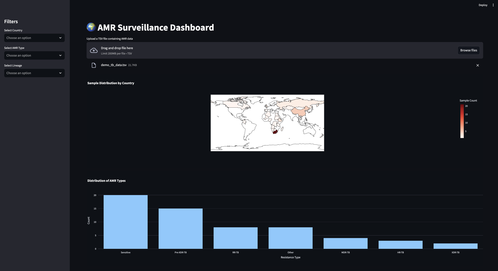

## AMR surveillance dashboard

The *AMR Surveillance Dashboard* is an interactive web-based application built with Streamlit for exploring global antimicrobial resistance (AMR) trends. It provides real-time insights into resistance profiles, genetic markers, and lineage distributions across countries, based on genomic surveillance data. Designed for public health researchers, genomic epidemiologists, & policy analysts, it supports data-driven decision-making & AMR tracking.

---

---

## Features

- **Cleans** & normalizes the `resistance_genes` column
- **Standardizes** country names using the `pycountry` package
- **Interactive visualizations** for:
  - AMR resistance types
  - Lineage distribution
  - Sample geographic distribution on a world map
- **Sidebar filters** for:
  - Country / Region
  - Resistance type (e.g., MDR-TB, XDR-TB)
  - TB lineage

---

## Installation

Install Streamlit & required dependencies using Conda:

```bash
conda install -c conda-forge streamlit pycountry plotly pandas
```

Or using pip:

```bash
pip install streamlit pycountry plotly pandas
```

---

## Run the Streamlit App

To run the dashboard with file upload functionality:

```bash
streamlit run amr_global_tracker_with_uploader.py

```

Then, upload a `.tsv` file containing AMR data when prompted in the browser.

---

## Expected data format

The uploaded TSV file should contain the following columns:

- `sample_id`
- `Country_of_sample_collection`
- `tbprofiler_dr_type`
- `tbprofiler_resistance_genes`
- `tbprofiler_main_lineage`
- `tbprofiler_sub_lineage`

## Selected resources

```bash

## The Fleming Fund & The Open University

**https://www.open.edu/openlearncreate/course/index.php?categoryid=1985**

```

```bash

**Centre for Genomic Pathogen Surveillance**:

https://amr.watch/


```

---

## License

This project is provided under the MIT License.

---

## Contributions

Feel free to fork this repo and submit pull requests for improvements, especially new visualization types, data formats, or country-specific AMR overlays.
